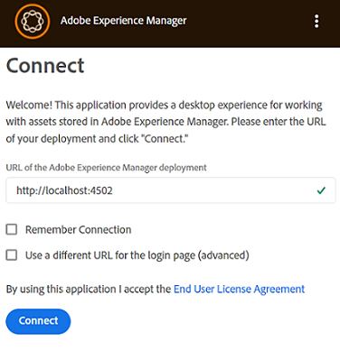

# 安裝 [!DNL Adobe Experience Manager] 案頭應用程式 {#install-app-v2}

使用 [!DNL Adobe Experience Manager] 案頭應用程式，及其中的資產 [!DNL Experience Manager] 可輕易地在本機案頭上使用，並可用於任何原生案頭應用程式。 您可以在案頭應用程式中預覽和開啟Assets。 它們可在Finder或Explorer中顯示以用於檔案，並在本機編輯。 變更會儲存回 [!DNL Experience Manager]，會在上傳時建立新版本。

這種整合可讓組織中的各種角色執行以下操作：

* 在中集中管理資產 [!DNL Experience Manager Assets].

* 存取任何原生案頭應用程式中的資產，包括第三方應用程式和Adobe Creative Cloud中的資產。 同時，使用者可輕鬆遵守各種標準，包括品牌推廣。

若要使用 [!DNL Experience Manager] 案頭應用程式：

* 確定您的 [!DNL Experience Manager] 版本與 [!DNL Experience Manager] 案頭應用程式。

* 下載並安裝應用程式。 另請參閱 [安裝案頭應用程式](#install-v2) 底下。

* 使用幾個資產測試連線。 另請參閱 [如何瀏覽及搜尋資產](using.md#browse-search-preview-assets).

## 系統需求、必要條件和下載連結 {#tech-specs-v2}

如需詳細資訊，請參閱 [[!DNL Experience Manager] 案頭應用程式發行說明](release-notes.md).

## 從舊版升級 {#upgrade-from-previous-version}

如果您是案頭應用程式v1.x的使用者，請瞭解舊版和最新版應用程式之間的差異和相似之處。 另請參閱 [案頭應用程式的新增功能](introduction.md#whats-new-v2) 和 [應用程式的運作方式](release-notes.md#how-app-works).

>[!NOTE]
>
>電腦上無法同時存在兩個版本的案頭應用程式。 安裝版本之前，請先解除安裝其他版本。

若要從舊版應用程式升級，請遵循下列指示：

1. 升級之前，請同步所有資產並將變更上傳至 [!DNL Experience Manager]. 這麼做可避免在解除安裝應用程式時遺失任何編輯內容。

1. 解除安裝應用程式的舊版。 解除安裝時，選取清除快取的選項。

1. 重新啟動電腦。

1. [下載](release-notes.md) 和 [安裝](#install-v2) 最新應用程式。 請依照下列指示操作。

## 安裝 {#install-v2}

若要安裝案頭應用程式，請依照下列步驟進行。 解除安裝任何現有的Adobe [!DNL Experience Manager] 案頭應用程式v1.x，然後再安裝最新版應用程式。 如需詳細資訊，請參閱上文。

1. 從下載最新的安裝程式 [發行說明](release-notes.md) 頁面。

1. 保留您的URL和認證 [!DNL Experience Manager] 部署方便。

1. 如果您從另一個應用程式版本升級，請參閱 [升級案頭應用程式](#upgrade-from-previous-version).

1. 如果您使用，請略過此步驟 [!DNL Experience Manager] as a [!DNL Cloud Service]， [!DNL Experience Manager] 6.4.4或更新版本，或 [!DNL Experience Manager] 6.5.0或更新版本。 確保您的 [!DNL Experience Manager] 安裝程式符合 [發行說明](release-notes.md). 如有必要，請下載適用的 [相容性套件](https://experience.adobe.com/#/downloads/content/software-distribution/en/aem.html?package=/content/software-distribution/en/details.html/content/dam/aem/public/adobe/packages/cq640/featurepack/adobe-asset-link-support) 並使用進行安裝 [!DNL Experience Manager] 封裝管理員作為 [!DNL Experience Manager] 管理員。 若要安裝套件，請參閱 [如何使用套件](https://experienceleague.adobe.com/en/docs/experience-manager-65/content/sites/administering/contentmanagement/package-manager).

1. 執行安裝程式二進位檔，並依照熒幕上的指示進行安裝。

1. 在Windows上，安裝程式可能會提示安裝 `Visual Studio C++ Redistributable 2015`. 請依照熒幕上的指示進行安裝。 如果安裝失敗，請手動安裝。 從下載安裝程式 [此處](https://www.microsoft.com/en-us/download/details.aspx?id=52685) 並安裝兩者 `vc_redist.x64.exe` 和 `vc_redist.x86.exe` 檔案。 重新執行 [!DNL Experience Manager] 案頭應用程式安裝程式。

1. 根據提示重新啟動電腦。 啟動並設定案頭應用程式。

1. 若要使用連線應用程式 [!DNL Experience Manager] 存放庫中，按一下系統匣中的應用程式圖示，然後啟動應用程式。 提供以下專案的位址： [!DNL Experience Manager] server，格式為 `https://[aem_server]:[port]/`.

   按一下 **[!UICONTROL Connect]** 並提供認證。

   

   *圖：連線畫面以輸入伺服器位址。*

   選取 **[!UICONTROL Remember Connection]** 以避免在每次登入案頭應用程式時輸入連線詳細資料。

   >[!CAUTION]
   >
   >請確定在的位址之前或之後，沒有前置或尾端空格 [!DNL Experience Manager] 伺服器。 否則，應用程式無法連線至 [!DNL Experience Manager] 伺服器。

1. [可選] 按一下 **[!UICONTROL I want to connect a different way]** 並按一下 **[!UICONTROL Adobe login]** 以使用AdobeExperience Manager Assets服務(IMS)登入Identity Management伺服器。 IMS登入可讓案頭應用程式自動執行存取Token重新整理，讓使用者在最多14天內保持登入狀態。 按一下 **[!UICONTROL Direct login]** 執行標準登入 [!DNL Experience Manager] 使用使用者認證的伺服器。

   

1. 成功連線後，您可以檢視的根資料夾中可用的資料夾和資產清單 [!DNL Experience Manager] DAM。 您可以從應用程式內瀏覽資料夾。

   

   *圖：應用程式在登入後顯示DAM內容*

1. ([!DNL Experience Manager] 6.5.1或更新版本)如果您使用的案頭應用程式包含 [!DNL Experience Manager] 6.5.1或更新版本，將S3或Azure聯結器升級至1.10.4或更新版本。 另請參閱 [Azure聯結器](https://experienceleague.adobe.com/en/docs/experience-manager-65/content/implementing/deploying/deploying/data-store-config#azure-data-store) 或 [S3聯結器](https://experienceleague.adobe.com/en/docs/experience-manager-65/content/implementing/deploying/deploying/data-store-config#amazon-s-data-store).

   如果您是Adobe Managed Services (AMS)客戶，請聯絡Adobe客戶支援。

## 設定偏好設定 {#set-preferences}

若要變更偏好設定，請按一下  和 **[!UICONTROL Preference]** . 在 **[!UICONTROL Preferences]** 視窗，調整下列值：

* [!UICONTROL Launch the application on logon]。

* [!UICONTROL Show a window when the application starts]。

* **[!UICONTROL Cache Directory]**：應用程式的本機快取位置（其中包含本機下載的資產）。

* **[!UICONTROL Network Drive Letter]**：用來對應至 [!DNL Experience Manager] DAM。 如果您不確定，請勿變更此網路磁碟機代號。 應用程式可對應至Windows上的任何磁碟機代號。 如果兩個使用者放置來自不同磁碟機代號的資產，他們將無法看到彼此放置的資產。 資產的路徑會變更。 資產仍會放在二進位檔案（例如INDD）中，且不會被移除。 應用程式會列出所有可用的磁碟機代號，預設會使用最後可用的代號，通常會 `Z`.

* **[!UICONTROL Maximum Cache Size]**：硬碟上允許的快取（以GB為單位），用於儲存本機下載的資產。

* **[!UICONTROL Current cache size]**：本機下載資產的儲存大小。 資訊只會在使用應用程式下載資產後顯示。

* **[!UICONTROL Automatically download linked assets]**：當您下載原始檔案時，系統會自動擷取放置在支援原生Creative Cloud應用程式中的資產。

* **[!UICONTROL Maximum number of downloads]**：  請謹慎變更。 首次下載資產時（透過「顯示」、「開啟」、「編輯」、「下載」或類似選項），只有當批次包含小於此數字時，才會下載資產。 預設值為 50。如果您不確定，請勿變更。 提高值可能會導致更長的等待時間，而降低值可能會阻止您在一次嘗試中下載所有必要的資產或資料夾。

* **[!UICONTROL Use legacy conventions when creating nodes for assets and folders]**：  請謹慎變更。 此設定可讓應用程式在上傳資料夾時模擬v1.10應用程式行為。 在v1.10中，在存放庫中建立的節點名稱會遵循使用者提供的資料夾名稱空格和大小寫。 不過，在應用程式v2.1中，資料夾名稱中的額外空格會轉換為破折號。 例如，上傳 `New Folder` 或 `new   folder` 如果未選取選項，且保留v2.1中的預設行為，則在存放庫中建立相同的節點。 如果選取此選項，則會在上述兩個資料夾的存放庫中建立不同的節點，且符合v1.10應用程式的行為。

  v2.1的預設行為保持不變：它以儲存庫節點名稱中的破折號取代資料夾名稱中的多個空格，並將節點名稱轉換為小寫。

* **[!UICONTROL Upload Acceleration]**：  請謹慎變更。 上傳資產時，應用程式可使用同時上傳來改善上傳速度。 您可以將滑桿向右移動，增加上傳的並行度。 最左側的滑桿表示沒有並行（單一執行緒上傳），中間位置對應於10個並行執行緒，而最右側的限制上限則對應於20個並行執行緒。 較高的並行限制會比較耗用資源。

若要更新無法使用的偏好設定，請登出 [!DNL Experience Manager] 然後更新。 更新偏好設定後，按一下 .


*圖：案頭應用程式偏好設定。*

### Proxy支援 {#proxy-support}

此 [!DNL Experience Manager] 案頭應用程式會使用系統預先定義的Proxy，透過HTTPS連線至網際網路。 應用程式只能使用不需要額外驗證的網路Proxy連線。

如果您設定或修改Windows的Proxy伺服器設定（「網際網路選項>區域網路設定」），請重新啟動 [!DNL Experience Manager] 案頭應用程式，讓變更生效。 當您啟動案頭應用程式時，會套用Proxy設定。 關閉應用程式並重新啟動應用程式，任何變更才會生效。

如果您的Proxy需要驗證，IT團隊可允許 [!DNL Experience Manager Assets] Proxy伺服器設定中的URL，允許應用程式流量通過。

## 解除安裝應用程式 {#uninstall-the-app}

若要在Windows上解除安裝應用程式，請執行下列步驟：

1. 將所有變更上傳至 [!DNL Experience Manager] 以避免遺失任何編輯。 另請參閱 [編輯資產和上傳更新的資產到 [!DNL Experience Manager]](using.md#edit-assets-upload-updated-assets). 登出並 [!UICONTROL Exit] 應用程式。

1. 移除應用程式，因為您已移除任何其他作業系統應用程式。 從Windows上的[新增和移除程式]解除安裝。

1. 若要移除快取和記錄，請選取必要的核取方塊。

   

1. 請依照熒幕上的指示進行。 完成後，請重新啟動電腦。

若要在Mac上解除安裝應用程式，請遵循下列步驟：

1. 將所有變更上傳至 [!DNL Experience Manager] 以避免遺失任何編輯。 另請參閱 [編輯資產和上傳更新的資產到 [!DNL Experience Manager]](using.md#edit-assets-upload-updated-assets). 登出並 [!UICONTROL Exit] 應用程式。

1. 移除 `Adobe Experience Manager Desktop.app` 從 `/Applications`.

或者，若要清除Mac上的內部應用程式快取並解除安裝應用程式，您可以在終端機中執行以下命令：

```shell
/Applications/Adobe Experience Manager Desktop/Contents/Resources/uninstall-osx/uninstall.sh
```
