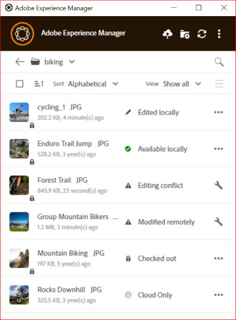

# 使用 [!DNL Adobe Experience Manager] 案頭應用程式 {#use-aem-desktop-app-v2}

使用 [!DNL Adobe Experience Manager] 案頭應用程式，用於存取儲存在 [!DNL Adobe Experience Manager] 本機案頭上的DAM存放庫。 然後您就可以在任何案頭應用程式中使用這些資產。 您可以在案頭應用程式中在本機開啟及編輯資產。 進行變更後，將它們上傳回 [!DNL Experience Manager] 使用版本控制來與其他使用者共用更新。 您也可以上傳新檔案和資料夾階層至 [!DNL Experience Manager]，建立資料夾，以及從中刪除資產或資料夾 [!DNL Experience Manager] DAM。

此整合可讓組織中的不同角色在中集中管理資產 [!DNL Experience Manager Assets] 以及在Windows或macOS的原生應用程式中存取本機案頭上的資產。

當您在登出後開啟應用程式或首次開啟應用程式時，請提供您的 [!DNL Experience Manager] server，格式為 `https://[aem-server-url]:[port]/`. 然後選取 [!UICONTROL Connect] 選項。 提供認證以將應用程式連線至伺服器。

您使用執行的主要工作 [!DNL Adobe Experience Manager] 案頭應用程式為：

![您可以使用完成的工作流程與任務 [!DNL Experience Manager] 案頭應用程式](assets/aem_desktop_app_usecases_v2.png "您可以使用完成的工作流程與任務 [!DNL Adobe Experience Manager] 案頭應用程式")

下載 [此](assets/aem_desktop_app_usecases_print.pdf) 可列印的PDF檔案。

## 案頭應用程式的運作方式 {#how-app-works2}

開始使用應用程式前，請先瞭解 [應用程式的運作方式](release-notes.md#how-app-works). 此外，請熟悉下列詞語：

* **[!UICONTROL Desktop Actions]**：從Assets Web介面中，在瀏覽器內可探索資產位置或取出並開啟資產，以在原生案頭應用程式中編輯。 這些動作可從Web介面取得，並使用案頭應用程式功能。 另請參閱 [如何啟用案頭動作](using.md#desktopactions-v2).

* 檔案狀態為 **[!UICONTROL Cloud Only]**：這類資產不會下載到本機電腦上，而且可在上使用 [!DNL Experience Manager] 僅限伺服器。

* 檔案狀態為 **[!UICONTROL Available locally]**：資產已下載並可在本機電腦上使用。 資產不會變更。

* 檔案狀態為 **[!UICONTROL Edited locally]**：這類資產會在本機修改，而變更會保留至上傳的 [!DNL Experience Manager] 伺服器。 上傳後，狀態會變更為 [!UICONTROL Available locally]. 另請參閱 [編輯資產](using.md#edit-assets-upload-updated-assets).

* 檔案狀態為 **[!UICONTROL Editing conflict]**：如果您與其他人同時編輯資產，應用程式會指出已發生編輯衝突。 應用程式也提供保留或捨棄變更的選項。 另請參閱 [如何避免編輯衝突](using.md#adv-workflow-collaborate-avoid-conflicts).

* 檔案狀態為 **[!UICONTROL Modified remotely]**：應用程式會指出您下載的資產是否在 [!DNL Experience Manager] 伺服器。 應用程式也提供下載最新版本和更新本機復本的選項。 另請參閱 [如何避免編輯衝突](using.md#adv-workflow-collaborate-avoid-conflicts).

* **[!UICONTROL Check-out]**：如果您正在編輯檔案或編輯檔案，您可切換狀態以出庫。 它會在應用程式的資產上新增鎖定圖示，並 [!DNL Experience Manager] 網頁介面。 鎖定圖示會向其他使用者指示，以避免同時編輯相同的資產，因為這會導致編輯衝突。

* **[!UICONTROL Check-in]**：將資產標示為安全，以供其他使用者編輯，而不會造成編輯衝突。 上傳變更時，鎖定圖示會自動移除。 切換籤入狀態也會移除鎖定圖示，但Adobe建議您避免手動簽入而不上傳變更。 如果您捨棄變更，請手動切換入庫。

* **[!UICONTROL Open]** 動作：只要開啟資產，即可在原生應用程式中預覽。 Adobe建議您避免使用此動作編輯資產。 原因是它不會簽出資產。 同時，其他使用者也可以進行編輯，導致編輯衝突。

* **[!UICONTROL Edit]** 動作：使用動作來修改影像。 按一下 [!UICONTROL Edit] 出庫資產並在資產上新增鎖定圖示。 按一下「編輯」後，如果不想編輯資產，請按一下 [!UICONTROL Toggle check-in]. 若要刪除、重新命名或移動中的資產 [!DNL Experience Manager] DAM資料夾階層，使用 [!DNL Experience Manager] 網頁介面動作，而非編輯動作。

* **[!UICONTROL Download]** 動作：將資產下載至本機電腦。 您現在可以下載資產，稍後再進行編輯；離線工作稍後再上傳變更。 Assets會下載到檔案系統的快取資料夾中。

* **[!UICONTROL Reveal File]** 或 **[!UICONTROL Reveal Folder]** 動作：將資產下載至本機快取資料夾時，應用程式會模擬本機網路磁碟機。 它提供每個資產的本機路徑。 若要知道此路徑，請使用應用程式中適當的顯示選項。 在Creative Cloud應用程式中放置資產時，需要顯示動作。 另請參閱 [置入資產](using.md#place-assets-in-native-documents).

* **[!UICONTROL Open In Web]** 動作：若要檢視中的資產，請執行下列動作： [!DNL Experience Manager] 網頁介面，請在網頁中開啟。 您可以從以下位置啟動更多工作流程： [!DNL Experience Manager] 介面，例如更新中繼資料或資產探索。

* **[!UICONTROL Delete]** 動作：從刪除資產 [!DNL Experience Manager] DAM存放庫。 該動作會刪除Experience Manager伺服器上的資產原始副本。 如果您只想捨棄對本機資產的修改，請參閱 [捨棄變更](using.md#edit-assets-upload-updated-assets).

* **[!UICONTROL Upload Changes]**：案頭應用程式只會在您明確上傳至時上傳更新的資產 [!DNL Experience Manager] 伺服器。 當您儲存編輯時，變更只會儲存在本機電腦上。 上傳時，資產會自動入庫，且鎖圖示會移除。 另請參閱 [編輯資產](using.md#edit-assets-upload-updated-assets).

## 在中啟用案頭動作 [!DNL Experience Manager] 網頁介面 {#desktopactions-v2}

從 [!DNL Assets] 使用者介面在瀏覽器中，您可以探索資產位置或取出並開啟資產，以在您的案頭應用程式中編輯。 這些選項稱為 [!UICONTROL Desktop Actions] 預設不會啟用和。 若要啟用此功能，請依照下列步驟執行。

1. 在 [!DNL Assets] 主控台，按一下 **[!UICONTROL User]** 圖示。
1. 按一下 **[!UICONTROL My Preferences]** 以顯示 **[!UICONTROL Preferences]** 對話方塊。

1. 在 [!UICONTROL User Preferences] 對話方塊，選取 **[!UICONTROL Show Desktop Actions For Assets]**，然後按一下 **[!UICONTROL Accept]**.

   

   *圖：選取 [!UICONTROL Show Desktop Actions For Assets] 以啟用案頭動作。*

## 瀏覽、搜尋和預覽資產 {#browse-search-preview-assets}

您可以瀏覽至、搜尋及預覽中的可用資產。 [!DNL Experience Manager] 存放庫，全部來自案頭應用程式。 在應用程式中嘗試下列操作：

1. 瀏覽至資料夾，並檢視資料夾中可用資產的一些基本資訊，以及所有資產的小縮圖。

   

1. 若要檢視詳細資訊和個別資產的大型縮圖，請按一下檔案名稱。

   

1. 按一下 **[!UICONTROL Open]** 或 **[!UICONTROL Edit]** 若要在本機下載檔案，請分別檢視檔案或在原生應用程式中進行編輯。
1. 使用關鍵字搜尋，以在 [!DNL Experience Manager] 存放庫。 使用 `?` 和 `*` 作為萬用字元。 這些萬用字元會分別取代單一字元或多個字元。 依需要篩選及排序結果。

   

   

>[!NOTE]
>
>應用程式會透過符合多個中繼資料欄位的搜尋條件來顯示資產，而不只是資產的標題或檔案名稱。

## 下載資產 {#download-assets}

您可以下載本機檔案系統上的資產。 應用程式會從擷取資產 [!DNL Experience Manager] 並將相同的復本儲存在本機檔案系統上。

按一下  ，然後按一下  以下載。

>[!NOTE]
>
>下載或上傳大型檔案或多個檔案時，應用程式會關閉對資產和資料夾的動作。 下載或上傳完成時，這些動作即可使用。

如果佇列大小很大或您遇到一些網路問題，下載多個資產可能會導致效能不佳。 此外，當您下載資料夾時，可能會無意中將許多資產排入下載佇列。 為避免冗長的等候時間，應用程式會限制單次下載的資產數量。 若要瞭解如何進行設定，請參閱 [設定偏好設定](install-upgrade.md#set-preferences). 即使低於此限制，應用程式有時也可能會在下載明顯大型的資料夾之前尋求確認。

如果選取並下載資料夾，應用程式只會下載直接儲存在資料夾中的資產。 [!DNL Experience Manager]. 它不會自動從子資料夾中下載資產。

## 在案頭上開啟資產 {#openondesktop-v2}

您可以開啟遠端資產，以便在原生應用程式中檢視。 資產會下載至本機資料夾。 然後，它們會在與檔案格式相關的原生應用程式中啟動。 您可以變更原生應用程式，以在Mac或Windows中開啟特定檔案型別（副檔名）。

按一下 **[!UICONTROL Open]** 從資產功能表。 資產會從本機下載，並以原生應用程式開啟。 檢查狀態列中大型資產的下載進度和傳輸速度。

<!-- 
-->

>[!NOTE]
>
>如果應用程式未反映預期的變更，請按一下重新整理圖示  或在應用程式介面中按一下右鍵，然後按一下 **[!UICONTROL Refresh]**. 進行較大型的下載或上傳時，無法使用這些動作。

若要開啟資產的本機下載資料夾，請按一下  並按一下  **[!UICONTROL Reveal File]** 動作。

## 使用資產或將資產放入原生檔案 {#place-assets-in-native-documents}

在某些情況下，例如將資產放入原生檔案時，您可以在Windows檔案總管或Mac Finder中存取檔案。 若要前往本機下載檔案的檔案系統位置，請使用  **[!UICONTROL Reveal File]** 選項。

按一下 **[!UICONTROL Reveal File]**，或 **[!UICONTROL Reveal Folder]** 在資料夾上，以使用本機電腦上預先選取的檔案或資料夾來開啟Windows檔案總管或Mac Finder。 例如，選項對於放置 [!DNL Experience Manager] 原生應用程式中支援放置或連結本機檔案的檔案。 若要瞭解如何在Adobe InDesign中置入檔案，請參閱 [置入圖形](https://helpx.adobe.com/indesign/using/placing-graphics.html).

此 **[!UICONTROL Reveal File]** 動作會開啟本機網路共用。 它只會顯示本機可用的資產。 也就是說，會顯示使用應用程式揭露、下載或開啟/編輯的資產。 本機網路共用不會上傳任何變更至 [!DNL Experience Manager]. 若要上傳變更，請明確使用 **[!UICONTROL Upload Changes]** 或 **[!UICONTROL Upload]** 動作次數。

>[!NOTE]
>
>回溯相容於 [!DNL Experience Manager] 案頭應用程式v1.x中，顯示的檔案是從本機網路共用提供服務，只會公開本機可用的檔案。 顯示檔案的案頭路徑與應用程式v1.x建立的路徑相同。

>[!CAUTION]
>
>請勿使用 **[!UICONTROL Reveal File]** 可在原生應用程式中編輯資產的選項。 請改用 **[!UICONTROL Edit]** 動作。 若要瞭解更多，請參閱 [進階工作流程：在相同檔案上共同作業並避免編輯衝突](#adv-workflow-collaborate-avoid-conflicts).

## 編輯資產和上傳更新的資產到 [!DNL Experience Manager] {#edit-assets-upload-updated-assets}

當您想要進行變更並將更新的資產上傳到時，請開啟資產以供編輯 [!DNL Experience Manager] 伺服器。 為避免與其他使用者的編輯發生衝突，請使用應用程式來起始編輯工作階段。 開始編輯之前，請確定資產上沒有鎖定圖示，表示有其他使用者正在編輯資產。

若要編輯資產，請搜尋資產或瀏覽至資產位置。 按一下  並按一下 **[!UICONTROL Edit]**.

使用 **[!UICONTROL Toggle Check-out]** 若要鎖定資產，以防止在下列兩種情況下與其他使用者的編輯發生衝突：

* 您已開始編輯資產，但未先將資產出庫（例如，直接開啟資產）。
* 您打算儘快開始編輯資產，不希望其他人編輯。

完成編輯後，應用程式會顯示 **[!UICONTROL Edited Locally]** 已變更資產的狀態。 儲存至資產的所有變更僅在本機進行，直到您上傳變更至 [!DNL Experience Manager]. 若要逐一上傳個別或數個資產，請按一下 **[!UICONTROL Upload Changes]** 從資產的選項中。 這會在中建立該資產的版本 [!DNL Experience Manager]. 使用的Web介面 [!DNL Assets]，您可以在中檢視資產歷史記錄 [時間表檢視](https://experienceleague.adobe.com/en/docs/experience-manager-65/content/assets/using/activity-stream).

如需合作編輯的最佳實務，請參閱 [進階工作流程：在相同檔案上共同作業並避免編輯衝突](#adv-workflow-collaborate-avoid-conflicts).

在下列情況下，您可能會想要捨棄本機資產的變更和編輯。 按一下「**[!UICONTROL Discard Changes]**」。

* 如果您不想將變更儲存在本機 [!DNL Experience Manager].
* 儲存部分變更後，開始變更原始資產。
* 停止編輯不再需要的資產。

如有必要，請切換出庫。 更新的資產會從本機快取資料夾中移除，並在您編輯或開啟時再次下載。

## 上傳並新增新資產到 [!DNL Experience Manager] {#upload-and-add-new-assets-to-aem}

使用者可新增資產至DAM存放庫。 例如，您可能是一位代理攝影師或承包商，想要將大量照片從拍照新增至 [!DNL Experience Manager] 存放庫。 若要新增內容至 [!DNL Experience Manager]，選取  應用程式頂端列中的。 瀏覽至本機檔案系統中的資產檔案，然後按一下 **[!UICONTROL Select]**. 或者，若要上傳資產，請在應用程式介面上拖曳檔案或資料夾。 在Windows上，如果您在應用程式內的資料夾中拖曳資產，資產會上傳至資料夾。 如果上傳時間較長，應用程式會顯示進度列。

<!-- 
-->

您可以從您的本機檔案系統上傳資料夾或個別檔案。 資料夾的階層會在上傳時保留。 大量上傳資產之前，請參閱 [大量上傳](#bulk-upload-assets).

若要檢視指定工作階段中轉移的資產清單，請按一下 **[!UICONTROL View]** > **[!UICONTROL Assets transfers]**. 清單可讓您檢視並快速驗證目前工作階段的檔案傳輸。

您可以在中控制上傳並行（加速） **[!UICONTROL Preferences]** > **[!UICONTROL Upload acceleration]** 設定。 更多並行作業通常可讓上傳速度更快，但可能會耗費大量資源，耗用本機電腦的更多處理能力。 如果系統速度緩慢，請使用較低的並行值來重新嘗試上傳。

>[!NOTE]
>
>傳輸清單不是永久性的，而且如果您結束應用程式並重新開啟應用程式，將無法使用。

### 管理資產名稱中的特殊字元 {#special-characters-in-filename}

在舊版應用程式中，在存放庫中建立的節點名稱會保留使用者提供的資料夾名稱空格和大小寫。 若要讓目前應用程式模擬v1.10應用程式的節點命名規則，請啟用 [!UICONTROL Use legacy conventions when creating nodes for assets and folders] 在 [!UICONTROL Preferences]. 另請參閱 [應用程式偏好設定](/help/using/install-upgrade.md#set-preferences). 此舊版偏好設定預設為停用。

>[!NOTE]
>
>應用程式只會使用下列命名慣例變更存放庫中的節點名稱。 應用程式會保留 `Title` 資產的狀態。

<!-- TBD: Do NOT use this table.

| Where do characters occur | Characters | Legacy preference | Renaming convention | Example |
|---|---|---|---|---|
| In file name extension | `.` | Enabled or disabled | Retained as is | NA |
| File or folder name | `. / : [ ] | *` | Enabled or disabled | Replaced with a `-` (hyphen) | `myimage.jpg` remains as is and `my.image.jpg` changes to `my-image.jpg`. |
| Folder name | `% ; # , + ? ^ { } "` | Disabled | Replaced with a `-` (hyphen) | tbd |
| File name | `% # ? { } &` | Disabled | Replaced with a `-` (hyphen) | tbd |
| File name | Whitespaces | Enabled or disabled | Retained as is | NA |
| Folder name | Whitespaces | Disabled | Replaced with a `-` (hyphen) | tbd |
| File name | Uppercase characters | Disabled | Retained as is | tbd |
| Folder name | Uppercase characters | Disabled | Replaced with a `-` (hyphen) | tbd |
-->

| 字元‡ | 應用程式中的舊版偏好設定 | 當出現在檔案名稱中 | 當出現在資料夾名稱中時 | 範例 |
|---|---|---|---|---|
| `. / : [ ] \| *` | 啟用或停用 | 已取代為 `-` （連字型大小）。 A `.` 副檔名中的（點）會維持原狀。 | 已取代為 `-` （連字型大小）。 | `myimage.jpg` 維持原狀，且 `my.image.jpg` 變更為 `my-image.jpg`. |
| `% ; # , + ? ^ { } "` 和空格 |  已停用 | 保留空格 | 已取代為 `-` （連字型大小）。 | `My Folder.` 變更為 `my-folder-`. |
| `# % { } ? & .` |  已停用 | 已取代為 `-` （連字型大小）。 | 不適用 | `#My New File.` 變更為 `-My New File-`. |
| 大寫字 |  已停用 | 大小寫維持原狀。 | 變更為小寫字元。 | `My New Folder` 變更為 `my-new-folder`. |
| 大寫字 |  已啟用 | 大小寫維持原狀。 | 大小寫維持原狀。 | 不適用 |

‡字元清單是以空格分隔的清單。

<!-- TBD: Check if the following is to be included in the footnote.

Do not use &#92;&#92; in the names of files and &#92;&#116; &#38; in the names of folders. 
-->

<!-- TBD: Securing the below presentation of the same content in a comment.

**File names**

| Characters | Replaced by |
|---|---|
| &#35; &#37; &#123; &#63; &#125; &#38; &#46; &#47; &#58; &#91; &#124; &#93; &#42; | hyphen (-) |
| whitespaces | whitespaces are retained |
| capital case | casing is retained |

>[!CAUTION]
>
>Avoid using &#92;&#92; in file names.

**Folder names**

| Characters | Replaced by |
|---|---|
| Characters | Replaced by |
| &#37; &#59; &#35; &#44; &#43; &#63; &#94; &#123; &#123; &#34; &#46; &#47; &#59; &#91; &#93; &#124; &#42; | hyphen (-) |
| whitespaces | hyphen (-) |
| capital case | lower case |

>[!CAUTION]
>
>Avoid using &#92;&#92; &#92;&#116; &#38; in folder names.

>[!NOTE]
>
>If you enable [!UICONTROL Use legacy conventions when creating nodes for assets and folders] in app [!UICONTROL Preferences], then the app emulates v1.10 app behavior when uploading folders. In v1.10, the node names created in the repository respect spaces and casing of the folder names provided by the user. For more information, see [app Preferences](/help/using/install-upgrade.md#set-preferences).

-->

## 使用多個資產 {#work-with-multiple-assets}

使用者可以透過動作（例如一次上傳所有編輯內容，或按幾下上傳巢狀資料夾）輕鬆處理和管理多個資產。

### 瀏覽大型資料夾 {#browse-large-folders}

使用包含許多資產的檔案夾時，請捲動以檢視更多資產。 若要使用鍵盤捲動，請按幾次Tab鍵以選取頂端的資產。 請注意醒目提示的資產，以知道何時選取它。 現在請使用向下鍵在資產清單中移動。

### 所選資產的快速動作 {#quick-actions-for-selected-assets}

按一下一些資產的縮圖以選取資產。 若要選取所有資產，請按一下應用程式頂端列中的核取方塊。 一組適用於所有已選取資產的動作會一起顯示在應用程式底部的工具列中。

底部工具列中的可用動作取決於所選檔案的狀態。 例如，如果您只選取 **[!UICONTROL Edited Locally]** 檔案，您會看到 **[!UICONTROL Upload Changes]** 圖示。 如果您選取 **[!UICONTROL Edited locally]** 和 **[!UICONTROL Cloud only]**，則 **[!UICONTROL Upload Changes]** 動作無法使用。

### 尋找所有已編輯的影像 {#find-all-edited-images}

應用程式會提供一個檢視，稱為 **[!UICONTROL Edited locally]**，讓您能夠快速存取本機下載的所有檔案(透過 [!UICONTROL Open] 或 [!UICONTROL Edit] 動作)，然後進行修改。 應用程式可讓您選取所有在本機編輯的資產，並按幾下滑鼠即可上傳變更。 此檢視也會顯示有編輯衝突的本機編輯資產。

### 大量上傳資產 {#bulk-upload-assets}

使用者或組織（例如攝影師或創意代理商）可在拍攝、潤飾或從較大集合中選取等活動中建立許多本機資產。 這些工作通常是在以下專案之外完成： [!DNL Experience Manager]. 他們可以上傳這些大型本機資料夾到 [!DNL Assets] 直接從案頭應用程式。 會保留資料夾階層，並上傳所有巢狀子資料夾和包含的資產。 相同伺服器的其他使用者也可以立即使用上傳的資產。 Assets會在背景上傳，因此操作不會繫結至網頁瀏覽器工作階段。

![從您的案頭大量上傳多個本機資料夾到 [!DNL Experience Manager]](assets/upload_local_folders_da2.png "從您的案頭大量上傳多個本機資料夾至Experience Manager")

上傳後，如果預期變更未反映在應用程式中，請按一下重新整理圖示 .

>[!NOTE]
>
>請勿使用上傳功能跨兩個移轉資產 [!DNL Experience Manager] 部署。 請改為參閱 [移轉指南](https://experienceleague.adobe.com/en/docs/experience-manager-65/content/assets/administer/assets-migration-guide).

### 已轉移資產的清單 {#list-of-transferred-assets}

若要檢視指定工作階段中轉移的資產清單，請參閱 [將資產上傳至 [!DNL Experience Manager]](#upload-and-add-new-assets-to-aem).

## 進階工作流程：從 [!DNL Assets] 網頁介面 {#adv-workflow-start-from-aem-ui}

如有需要，請從Assets網頁介面啟動您的工作流程。 案頭應用程式整合了 [!DNL Experience Manager] ，以便在收到使用案頭動作的請求時接管。

從Web介面啟動工作流程的一個特殊情況是資產探索。 Assets使用者介面中的Omnisearch列提供豐富而進階的搜尋體驗。 建議您先在網頁上找出想要的資產，然後使用在應用程式中起始工作流程 [!UICONTROL Desktop Actions]. 某些範例案例包含使用Facet篩選搜尋結果、尋找從Adobe Stock授權的特定資產，或貴組織實作的自訂，以便您更妥善地從Web介面探索。

當您嘗試在Assets網頁介面上執行下列動作時，就會使用案頭應用程式功能：

* 此 [!UICONTROL Desktop Actions] 允許 [!UICONTROL Open]， [!UICONTROL Edit]、和 [!UICONTROL Reveal]
* [!UICONTROL Upload folder]
* [!UICONTROL Check-out] 或 [!UICONTROL check-in]

例如，應用程式中出庫之資產可在Web介面上使用的動作，包括 [!UICONTROL Open]， [!UICONTROL Reveal]、和 [!UICONTROL Check in].

![中的案頭動作 [!DNL Experience Manager] 網頁介面](assets/assets_web_actions_da2.png "Experience Manager網頁介面中的案頭動作")

>[!NOTE]
>
>瀏覽器可能會提示您允許啟動 [!DNL Adobe Experience Manager] 案頭。 若要每次都能不間斷地從瀏覽器傳輸至應用程式，請選取適當的核取方塊，讓應用程式接管。

使用Web介面找不到下列資訊或工作流程。 使用案頭應用程式，因為Web介面不會追蹤本機變更，且不瞭解下列內容：

* 檔案是在本機編輯的。
* 具有編輯衝突及解決衝突方法的檔案。
* 上傳本機變更至 [!DNL Experience Manager].
* 本機可用檔案的各種狀態。

相反地，您可以從使用的案頭應用程式開始，在網頁介面中開啟資產 **[!UICONTROL Open In Web]** 動作。

## 進階工作流程：在相同檔案上共同作業並避免編輯衝突 {#adv-workflow-collaborate-avoid-conflicts}

在合作環境中，多位使用者可能會使用相同的資產集，這可能會導致版本設定衝突。 若要避免衝突，請遵循下列最佳實務：

* 請勿按一下以編輯任何資產 [!UICONTROL Open]. 請勿透過從檔案系統資料夾中開啟來編輯本機下載的資產。 其他使用者不知道資產正在編輯中。
* 若要編輯資產，請一律按一下 [!UICONTROL Edit]. 它會在原生應用程式中開啟資產，並在資產上新增鎖定圖示，讓其他使用者知道資產正在編輯中。
* 按一下 [!UICONTROL Toggle Check-in] 如果您不小心沒有按一下就開始編輯 [!UICONTROL Edit]. 此功能會將鎖定圖示新增至資產。 即使您打算稍後編輯資產，但想避免他人編輯資產，請按一下 [!UICONTROL Toggle Check-in] 以鎖定資產。
* 在編輯資產之前，請確定其他使用者未編輯該資產。 尋找資產上的鎖定圖示。
* 完成編輯後，請上傳所有變更，然後入庫資產。

如果本機下載的資產更新於 [!DNL Experience Manager] 伺服器，應用程式會顯示 **[!UICONTROL Modified remotely]** 狀態。 您可以移除本機復本，或按一下 [!UICONTROL Remove] 或 [!UICONTROL Update] （分別）。 對話方塊中的連結可讓您檢視資產的兩個版本。

如果您在本機編輯的資產也在您不知情的情況下在伺服器上更新，應用程式會顯示 **[!UICONTROL Editing Conflict]** 狀態。 您可以保留一組變更，也可以保留您的更新(按一下 **[!UICONTROL Keep Mine]**)，並刪除其他使用者的編輯或遵循其他使用者的更新，然後刪除您的更新(**[!UICONTROL Overwrite Mine]**)。

## 進階工作流程：在InDesign檔案中放置並連結資產 {#adv-workflow-place-assets-indesign}

當您使用 [!DNL Experience Manager] 案頭應用程式若要開啟含有連結資產的檔案，資產會預先下載，並放置在原生應用程式中。 為了讓此工作流程正常運作，您的原生應用程式必須支援將連結放置到本機資產，並 [!DNL Experience Manager] 必須支援將二進位檔案中的這些連結解析為伺服器端參考。

[!DNL Experience Manager] 案頭應用程式可支援此工作流程，包括一些特定的Adobe Creative Cloud案頭應用程式和檔案格式 — Adobe InDesign、Adobe Illustrator和Adobe Photoshop。 工作流程可讓您有效率地使用支援的Creative Cloud檔案。 如果使用者A將資產新增到InDesign檔案並將其簽入 [!DNL Experience Manager]，使用者B可以看到檔案中的資產，即使這些資產不屬於該檔案。 資產會從使用者B的電腦本機下載。

>[!NOTE]
>
>案頭應用程式可對應至Windows上的任何磁碟機。 不過，若要順利作業，請勿變更預設磁碟機代號。 如果相同組織的使用者使用不同的磁碟機代號，則他們看不到其他人置入的資產。 路徑變更時不會擷取已放置的資產。 置入的資產會繼續置於二進位檔案（例如INDD）中，且不會移除。

若要瞭解此工作流程的限制，請參閱 [系統需求和支援的版本](release-notes.md).

若要使用影像資產和InDesign來嘗試此工作流程，請遵循下列步驟：

1. 將置入資產的INDD檔案儲存在 [!DNL Experience Manager]. 若要瞭解如何建立這種INDD檔案，請參閱 [置入圖形](https://helpx.adobe.com/indesign/using/placing-graphics.html).
1. 從案頭應用程式內， **[!UICONTROL Edit]** 置入資產的INDD檔案 [!DNL Experience Manager].
1. 應用程式會下載InDesign檔案和連結的資產。 當InDesign開啟檔案時，會解析連結、下載資產，且資產會顯示在InDesign檔案中。
1. 若要在InDesign檔案中放置新圖形，請使用 **[!UICONTROL Reveal File]** 對資產執行動作。 此動作會在本機下載資產，並在Windows檔案總管或Mac Finder中開啟本機網路共用位置。
1. 將顯示的資產放入InDesign檔案中。 這樣做會在檔案中建立連結。
1. 在InDesign檔案中完成編輯後，請儲存並上傳至 [!DNL Experience Manager] 使用案頭應用程式。

## 進階工作流程：在本機下載資產 {#adv-workflow-download-assets-locally}

應用程式經常會從下載資產 [!DNL Experience Manager] 伺服器到您的本機檔案系統。 下載耗用頻寬和磁碟空間。 瞭解情況有助於您最佳化完成下載的等待時間。

您可以隨選從應用程式內下載資產。 另請參閱 [下載資產](#download-assets).

當您使用 [!UICONTROL Open] 動作若要在原生案頭應用程式中開啟資產，如果資產無法在本機取得，則會從本機下載。 另請參閱 [開啟資產](#openondesktop-v2).

當您從應用程式內顯示資產或資料夾的位置時，資產或資料夾會先在本機下載，然後在您電腦上的本機網路共用中開啟。 另請參閱 [開啟資產](#openondesktop-v2).

當您使用 [!UICONTROL Edit] 動作若要編輯原生案頭應用程式中的資產，如果資產尚未在本機提供，則會從本機下載。 另請參閱 [編輯資產和上傳更新的資產到 [!DNL Experience Manager]](#edit-assets-upload-updated-assets).

如果應用程式已安裝並獲准使用，則會在您使用時完成動作 [!UICONTROL Desktop Actions] 從 [!DNL Experience Manager] 網頁介面。 應用程式會先下載資產，然後完成動作。
