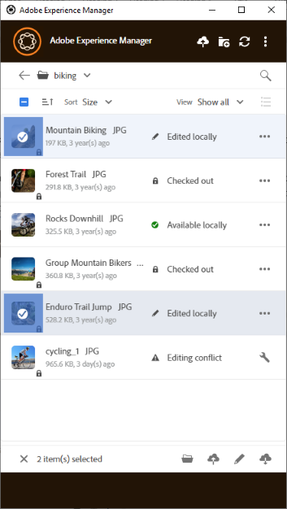

# 使用多個資產 {#work-with-multiple-assets}

使用者可以透過動作（例如一次上傳所有編輯內容，或按幾下上傳巢狀資料夾）輕鬆處理和管理多個資產。

## 瀏覽大型資料夾 {#browse-large-folders}

使用包含許多資產的檔案夾時，請捲動以檢視更多資產。 若要使用鍵盤捲動，請按幾次Tab鍵以選取頂端的資產。 請注意醒目提示的資產，以知道何時選取它。 現在請使用向下鍵在資產清單中移動。

## 所選資產的快速動作 {#quick-actions-for-selected-assets}

按一下一些資產的縮圖以選取資產。 若要選取所有資產，請按一下應用程式頂端列中的核取方塊。 一組適用於所有已選取資產的動作會一起顯示在應用程式底部的工具列中。

底部工具列中的可用動作取決於所選檔案的狀態。 例如，如果您只選取&#x200B;**[!UICONTROL Edited Locally]**&#x200B;個檔案，您會看到&#x200B;**[!UICONTROL Upload Changes]**&#x200B;圖示。 如果您選取&#x200B;**[!UICONTROL Edited locally]**&#x200B;和&#x200B;**[!UICONTROL Cloud only]**&#x200B;的混合，**[!UICONTROL Upload Changes]**&#x200B;動作將不可用。

## 後續步驟 {#next-steps}

* [觀看開始使用Adobe Experience Manager案頭應用程式的影片](https://experienceleague.adobe.com/en/docs/experience-manager-learn/assets/creative-workflows/aem-desktop-app)

* 使用右側邊欄提供的[!UICONTROL Edit this page] 或[!UICONTROL Log an issue] 來提供檔案意見回饋

* 聯絡[客戶服務](https://experienceleague.adobe.com/?support-solution=General#support)

>[!MORELIKETHIS]
>
>* [上傳資產](/help/using/upload-assets.md)
>* [下載資產](/help/using/download-assets.md)
>* [搜尋](/help/using/search.md)
